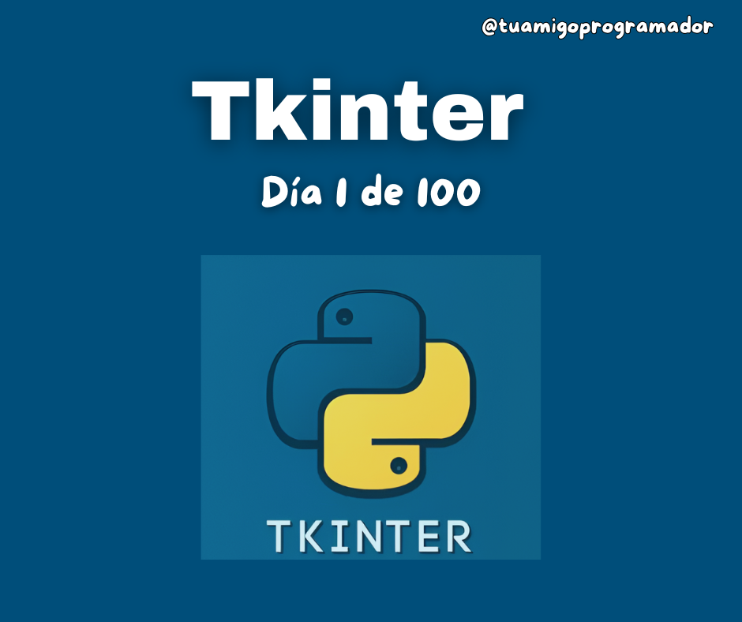

# 100 Días de Tkinter
100 Días en Tkinter es un proyecto o guía, que ha sido desarrollado con fines edúcativos y de orientación
a principiantes en el mundo de la programación.

Este repositorio contiene el proyecto de **100 días programando con Tkinter** o **Tkinter de 0 a 100%** en Python. 
Cada día se implementa prácticas, ejercicios y ejemplos distintos para aprender las habilidades en interfaces gráficas.

A medida que se valla progresando, se emplearan las prácticas aprendidas para resolver ejercicios y problemas.
Los días de ejercicios y problemas pueden variar, no habrá un día fijo.



---

## 📆 Progreso, Primero 10 días

- ✅ Día 1: Hola Mundo con Tkinter
- ✅ Día 2: Ventana básica
- ✅ Día 3: Etiquetas
- 🔲 Día 4: Botones y eventos
- 🔲 Día 5: Campos de entrada
- 🔲 Día 6: Text multilinea y scroll
- 🔲 Día 7: Frame y organización básica
- 🔲 Día 8: Sistema de layout - Pack,Grid,Place
- 🔲 Día 9: Checkbuttom, Radiobuttom
- 🔲 Día 10: Mensagebox y ventanas emergentes
- ... (en progreso)

---

## Requerimientos
Python 3 (O superior)
Tkinter (ya viene instalado con Python en la mayoría de sistemas)

---

## ¿Cómo usar?

Puedes descargar el codígo del día que quieras usar...
O clona este repositorio y entra en la carpeta del día que quieras probar:

```bash
git clone https://github.com/jesuspinedaof/100-dias-tkinter.git
cd 100-dias-tkinter/dia_01
python hola_mundo.py
```

---

### Tambien puedes ver prácticas, ejercicios y videos en Redes

#### 100 Días Tkinter
*YouTube:
https://www.youtube.com/playlist?list=PLaZLND08hkc_m9VjyImLZOMIo67SnXNOV

*Facebook:
https://www.facebook.com/media/set?vanity=Tuamigoprogramador&set=a.798338549798652 

---

### Contribuyendo

Si tiene alguna idea de cómo mejorar esto. Somos todo oído... Cualquier duda o error puede compartir la información.
¿Quieres atribuir u colaborar?, Para informar cualquier de estas al:
*tornioficial@gmail.com
*https://wa.me/584160601607

---

### Documentación de librerías utilizadas

#### Python Documentación
https://docs.python.org/3/
#### Python Tkinter docs
https://docs.python.org/es/3/library/tkinter.html


---

## Licencia

FreeBSD

Derechos de autor (c) 2025 - Jesús Pineda

---